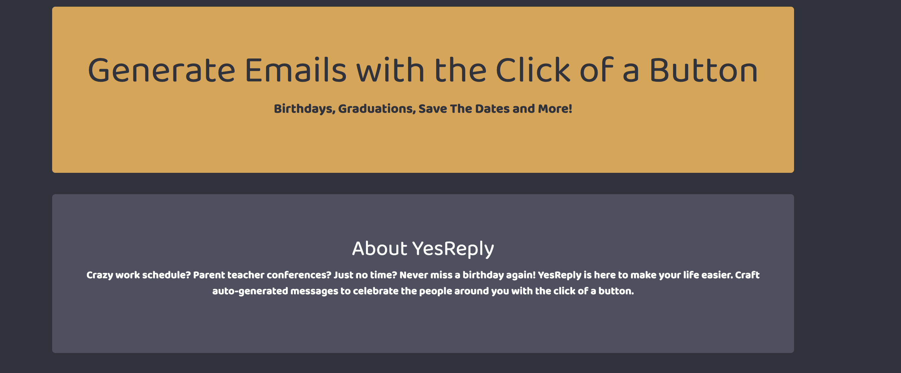

# Yes Reply
[](https://github.com/carolninganga/yes-reply)

## Description

YesReply uses two APIs (Words API and Linguatools) to facilitate message generation based on the user’s inputs and selected “life event”

## Table of Contents 

* [Installation](#installation)

* [Usage](#usage)

* [License](#license)

* [Contributing](#contributing)

* [Tests](#tests)

* [Questions](#questions)

## Installation

To install necessary dependencies, run the following command:

```
npm i
```

## Usage


## License

This project is licensed under the APACHE 2.0 license.
  
## Contributing


## Tests

To run tests, run the following command:

```
npm test
```

## Questions

If you have any questions about the repo, open an issue or contact [carolninganga](undefined) directly at carolninganga@gmail.com.

